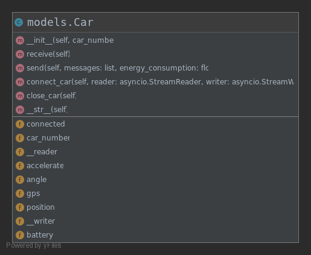

# Sink节点代码文档

## 第一章 简介

### 1.1 概述

对于Sink节点，无论是同步还是异步，都需实现以下四个核心功能：
1. 实现与监控小车的实时通信，包括小车数据的上行和控制命令的下行。
2. 实现与UWB的实时通信，包括UWB周期上报的测距信息。
3. 实现目标跟踪算法，主要是根据三点定位算法求出目标的当前位置，再进行小车的调度。
4. 实现与后端服务器的实时通信，包括监控区域的数据回传。

在同步版本中，目前只实现了功能一、功能二和功能三，功能四将在异步版本中实现，该版本中暂未实现。

### 1.2 项目结构

Sink节点基于Python3开发，项目结构如图：

<div align="center">  </div>

其中，各个目录的含义如下：
1. docs: 该项目的相关文档。
2. history: 该项目的一些历史版本，以及测试例程。
    * original_sink: 最原始版本的Sink代码，主要功能仅为控制小车、获取小车视频流。
    * sync_sink: 同步版本的Sink代码。
    * aio_test: 帮助理解异步模式的测试代码。
3. logs: 记录小车和UWB的回传数据的日志。
4. src: 最新版本的Sink源码，目前是异步版本。

### 1.3 项目搭建

项目环境搭建过程：
1. 该项目基于Python3.7，故首先需要安装Python3.7。
2. 推荐使用Pycharm作为项目编译器。
3. 依赖包管理
	* 安装依赖包
		* Pycharm Terminal 中打开项目目录，执行 pip install -r requirements.txt
		* 该命令执行成功后，将把项目所需的依赖全部安装
	* 导出依赖包
		* 首先安装 pipreqs：pip install pipreqs
		* 在项目目录下执行：pipreqs . --encoding=utf8 --force
		* 该命令执行成功后，将把项目所依赖的包全部写入到requirements.txt文件中

## 第二章 同步版Sink

### 2.1 概述

同步版Sink采取的技术方案为**多线程+BIO**。

对于Sink而言，需要保持和多辆监控小车的TCP socket通信，和三个UWB的TCP socket通信，以及和后端服务器的HTTP通信(同步版未实现)。因此，初步想法是采取多线程的方式，每一个线程以BIO的方式负责一个socket的数据接收，由主线程来实现socket的数据发送。

> *同步版Sink代码涉及的技术除了Python外，主要需要掌握多线程和socket通信。*

同步版Sink主要涉及到的模块为 /history/sync_sink 目录下的几个模块，其使用到的公共模块将在异步版Sink中进行介绍，本章的主要内容将对同步版Sink的主要API进行解析。

### 2.2 models.py

该模块只包含两个重要的类，即Car和UWB。

##### Car类

Car类的UML类图如下：

<div align="center"> </div>

###### Car类的属性

| 属性名     | 类型   | 含义                     |
| ---------- | ------ | ------------------------ |
| car_number | int    | 小车的编号               |
| gps        | List   | 小车的gps                |
| accelerate | List   | 小车的加速度             |
| angle      | List   | 表示小车的角度           |
| position   | List   | 表示小车的平面位置       |
| battery    | float  | 表示小车的电量           |
| connected  | bool   | 表示小车是否已经连接     |
| socket     | Socket | 表示小车对应的socket对象 |

###### Car类的方法

1、receive()：接收小车的上行数据，该方法主要涉及以下内容：

* 通过socket接收上行数据并解析，**解析规则**：每条上行数据只包含一个ACC、Angle、GPS，数据包之间用一个"#"分隔，数据包内的变量间用";"分隔，各变量的内部分量用","分隔。
* 记录小车回传的数据到日志中。

> 在解析上行数据时，需要处理*TCP粘包问题*，已在receive()中实现。

2、send(messages, energy_consumption)：向小车发送下行数据，并模拟消耗电量

##### UWB类

UWB类的模型大致与Car类相似，这里仅单独描述UWB的上行数据的解析规则：每个上行包只包含一个distance，数据包之间用一个"#"分隔。

### 2.3 car_control.py

该模块负责小车的一些控制功能，在调度的时候使用。

##### get_control(cmd: str)

方法作用：根据cmd指令，返回具体的指令码和模拟消耗的电量。

方法逻辑：略

##### move_forward_target()

方法作用：根据小车和目标的位置关系，让小车做出相应的移动。

方法逻辑：

<div align="center"> </div>

##### top3_best_cars()

方法作用：从多辆小车中选择出最优的三辆小车。

方法逻辑：

<div align="center"> </div>

### 2.4 test_utils.py

该模块主要存放测试时可能会用到的一些方法，如键盘读取、目标轨迹生成等，此处不再赘述。

### 2.5 server_xxx.py

server类型的模块是同步版Sink的**核心代码**，多个server_xxx.py文件主要针对不同的测试场景，如：单小车追单小车、三辆小车追单小车等。此处，将以server_for_three_car.py为例，对其结构进行详细介绍。

##### server_for_three_car.py

<div align="center"> </div>

### 2.6 同步版Sink存在的问题

同步版Sink的技术选型为**多线程+BIO**的方式，该方案存在以下问题：
1. 理论上在多核CPU下可以让多线程并行执行，即BIO不会影响Sink的性能。然而，由于 *Python GIL锁* 的存在，使得多线程的效率骤降，几乎等价于单线程的程序，因此BIO仍会造成Sink的阻塞。
2. 随着BIO的数量增大(如接入小车数增大)，Sink的阻塞时长会越来越大，将造成小车接收下行的间隔增大，即小车的停顿时间变长。

## 第三章 异步版Sink

### 3.1 概述

异步版Sink采取技术方案是**协程(AIO)**。

同步版Sink的性能由于BIO而大大降低，因此在异步版Sink中，选择使用协程(AIO)来代替多线程+BIO的方案。协程被称为“单线程里的并发”，其本质是体现程序员的任务调度技巧。在异步版Sink中，将会对原有代码重构，涉及到的AIO：与小车的通信、日志文件的记录和与后端服务器的通信。协程调度的核心思想：若当前协程A发生阻塞时，立即切换到另一个未阻塞的协程B，当协程A就绪后，才有机会再次被切换执行。

Python 对协程提供有非常多的支持，但都需要自己手动编写，没有现有框架。重点需要学习的库：
1. **asyncio**：Python标准库，是学习Python协程的基础库，提供了非常丰富的异步API，建议在官方文档中完整的学习其高层API，熟悉事件循环、协程、任务、流等核心概念。
2. aiofiles：第三方库，提供了文件IO的异步操作。
3. aiohttp：第三方库，提供了HTTP的异步操作。
> 该部分的学习可以借助/history/aio_test目录下的几个文件进行理解

### 3.2 models.py

异步版的models.py大致上与同步版相同，此处单独介绍其改动点。

##### Car类

Car类的类图：

<div align="center"> </div>

###### Car类的属性

在异步版中，Car类的属性中去掉了socket对象，而新增加了两个属性：
* **reader**：asyncio.StreamReader对象，通过reader可以异步接收数据。
* **writer**：asyncio.StreamWriter对象，通过writer可以异步发送数据。

###### Car类的方法

Car类的方法在异步版中没有逻辑上的修改，仅仅将之前的同步操作替换为了异步操作。

##### UWB类

UWB类的模型改动点大致与Car类相似，不再赘述。

### 3.3 car_control.py

异步版car_control.py模块中的方法没有逻辑上的修改，仅仅将之前的同步操作替换为了异步操作，不再赘述。

### 3.4 gps_transform.py

该模块主要负责GPS与平面坐标的相互转换。该模块使用了pyproj第三方库，该库提供了GPS到平面坐标、平面坐标到GPS的转换API，了解即可。涉及的两个方法：
1. gps_transform(gps)：将一个GPS转换为平面坐标。
2. position_transform(position)：将一个平面坐标转换为GPS。

### 3.5 location.py

该模块主要存放定位算法，目前已经实现**三点定位算法**，即根据三个点和三个点到目标的距离，通过**最小二乘法**求解，获得目标的定位位置。

### 3.6 utils.py

该模块主要存放一些简单的函数工具，如获取项目根目录等。

### 3.7 aio_server_xxx.py

aio_server类型的模块是异步版Sink的**核心代码**，不同后缀的aio_server_xxx.py文件主要针对不同的测试场景，如：单小车追单小车、三辆小车追单小车等。此处，将以aio_server.py为例，对其结构进行详细介绍。

##### aio_server.py

<div align="center"> </div>

## 第四章 系统联调测试

本章将介绍如何进行系统联调测试，主要包括小车、Sink、后端服务器等组件。

### 4.1 测试流程

第一步：将所有组件连入同一局域网内，如利用手机热点、无线路由器等方式。

> 注意：
> 1. 确保小车代码中的 TCP socket 与 Sink 绑定的 socket 一致！
> 2. 尤其是换新的热点、新的主机作为Sink时，需修改小车代码中Sink的socket和Sink的ip映射表。

第二步：依次启动后端服务器、Sink和所有的小车(UWB)。

第三步：若需要重新测试，可以重新启动后端服务器、Sink和小车，小车端已设置开机自启动程序。

### 4.2 小车操作事项

Q：如何让小车连自己的热点？
A：默认小车都会有一个自己的WIFI(SSID=YahBoom_Car，密码=12345678)，可以让电脑先连上该WIFI，然后[使用浏览器登录小车的WIFI管理界面](https://www.yahboom.com/build.html?id=2765&cid=159)，选择自己要连的热点。

> 若某些小车没有该WIFI，则只有连接显示器，使用GUI来直接连热点。

Q：如何远程登录小车的树莓派？
A：使用PuTTY或WinSCP，输入小车的ip后登录，用户名=pi，密码=yahboo(同root密码)

Q：小车运行的代码在哪里？
A：代码路径：/home/pi/SmartCar/Clent_TCP.c

Q：如何让修改后的代码生效？
A：每次修改Clent_TCP.c后，需要进行编译(gcc Client_TCP.c -o Client_TCP -lwiringPi -lpthread)，完成后将生成可执行文件：Clent_TCP，通过 ./Clent_TCP 运行该文件或直接重启

Q：如何设置小车代码开机自启动？
A：步骤如下：
1、在/home/pi目录下创建TCP.sh文件：sudo vim TCP.sh
```shell
#!/bin/sh
sleep 1
cd /home/pi/SmartCar/
./Client_TCP &
```
2、在/home/pi/.config/autostart目录下创建TCP.desktop文件：sudo vim TCP.desktop

```shell
[Desktop Entry]
Type=Application
Name=test
NoDisplay=true
Exec=/home/pi/TCP.sh
```

Q：如何终止正在运行的Client_TCP程序？
A：在小车shell输入top，查看Client_TCP的端口号，直接 sudo kill -9 端口号